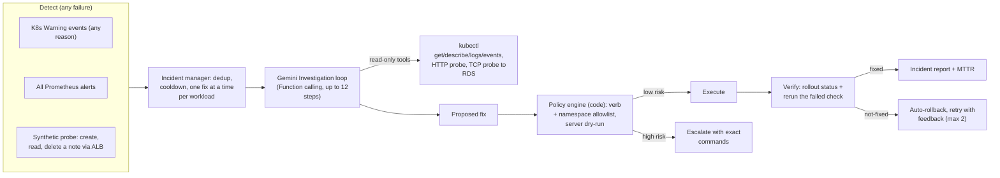

# Django Notes App — Production DevOps Project

A full-stack notes application built with **Django REST Framework** and **React**, deployed on **AWS EKS** with a complete production-grade DevOps pipeline. Features include automated CI/CD, container-native builds, Kubernetes orchestration, centralized monitoring, fully automated infrastructure as code, and an **autonomous AI SRE Agent** (Robusta + Gemini) for self-healing infrastructure.

---

## 🏗️ Architecture Overview

```
                        ┌─────────────────────────────────────────────┐
                        │                AWS Cloud                     │
                        │                                              │
  Browser ──────────► AWS CloudFront CDN                              │
                        │         │                                    │
                        │         ▼                                    │
                        │   S3 Static Website (React Frontend)         │
                        │                                              │
  Browser ──────────► AWS ALB (Ingress)                               │
                        │         │                                    │
                        │         ▼                                    │
                        │   EKS Fargate Cluster                        │
                        │   ┌─────────────────────────┐               │
                        │   │  Django Namespace        │               │
                        │   │  └─ Django Backend Pod   │               │
                        │   │                          │               │
                        │   │  Jenkins Namespace        │               │
                        │   │  └─ Jenkins Controller   │               │
                        │   │  └─ Ephemeral Agent Pods │               │
                        │   │                          │               │
                        │   │  Monitoring Namespace    │               │
                        │   │  └─ Prometheus           │               │
                        │   │  └─ Grafana              │               │
                        │   │                          │               │
                        │   │  Robusta Namespace       │               │
                        │   │  └─ Robusta Runner       │               │
                        │   │  └─ AI-SRE Python Agent  │               │
                        │   └─────────────────────────┘               │
                        │         │                                    │
                        │         ▼                                    │
                        │   RDS MySQL 8 (Private Subnet)               │
                        └─────────────────────────────────────────────┘
```

---

## 🛠️ Tech Stack

| Layer | Technology | Purpose |
|---|---|---|
| **Frontend** | React 18 | Single-page notes application |
| **Backend** | Django 4 + DRF | REST API server |
| **Database** | AWS RDS MySQL 8 | Persistent relational database |
| **Container Orchestration** | AWS EKS (Fargate) | Serverless Kubernetes cluster |
| **CI/CD** | Jenkins | Automated build and deployment pipeline |
| **Image Building** | Kaniko | Daemonless in-cluster Docker image builds |
| **Infrastructure as Code** | Terraform | Fully automated cloud provisioning |
| **Package Manager (K8s)** | Helm | Kubernetes application deployments |
| **Container Registry** | AWS ECR | Private Docker image registry |
| **Frontend Hosting** | AWS S3 | Static website hosting |
| **CDN** | AWS CloudFront | Content delivery and cache invalidation |
| **Secrets Management** | AWS Secrets Manager + External Secrets Operator | Secure credential injection into pods |
| **Ingress Controller** | AWS Load Balancer Controller | Kubernetes → ALB provisioning |
| **Persistent Storage** | AWS EFS | Shared storage for Jenkins workspace |
| **Monitoring** | Prometheus + Grafana | Cluster and application metrics |
| **Security Scanning** | Bandit (SAST) | Static code vulnerability analysis |
| **Identity** | IRSA (IAM Roles for Service Accounts) | Keyless AWS access from Kubernetes pods |
| **AI SRE Agent** | Robusta + Gemini API | Two-phase automated diagnosis and self-healing for Kubernetes |

---

## 📁 Project Structure

```text
.
├── backend/                        Django REST Framework application
│   ├── notesapp/                   Core app (models, views, serializers, settings)
│   ├── manage.py
│   ├── requirements.txt
│   └── Dockerfile                  Multi-stage production Docker image
│
├── frontend/                       React 18 single-page application
│   ├── src/
│   └── package.json
│
├── infra/
│   ├── terraform/
│   │   ├── environments/
│   │   │   └── prod/               Terraform root module (entry point)
│   │   │       ├── main.tf         Module composition (VPC, EKS, RDS, ECR, S3, EFS, Secrets)
│   │   │       ├── helm.tf         Helm releases (Jenkins, ALB Controller, ESO, Prometheus, Grafana)
│   │   │       ├── providers.tf    AWS + Kubernetes + Helm provider configuration
│   │   │       ├── variables.tf    Input variable declarations
│   │   │       ├── terraform.tfvars Variable values (DO NOT commit real credentials)
│   │   │       └── outputs.tf      Exported values (cluster endpoint, RDS host, etc.)
│   │   └── modules/
│   │       ├── vpc/                VPC, public/private subnets, NAT Gateway, route tables
│   │       ├── eks/                EKS cluster, Fargate profiles, OIDC provider, node security groups
│   │       ├── rds/                RDS MySQL instance, subnet group, security group
│   │       ├── ecr/                ECR repositories for backend and Jenkins agent images
│   │       ├── s3_frontend/        S3 bucket for React static website
│   │       ├── efs/                EFS file system for Jenkins persistent storage
│   │       └── secrets/            AWS Secrets Manager secret + External Secrets IRSA
│   │
│   ├── helm/
│   │   ├── django-backend/         Helm chart for the Django REST API
│   │   │   ├── templates/          Deployment, Service, Ingress, HPA manifests
│   │   │   └── values-prod.yaml    Production overrides
│   │   ├── jenkins/                Helm values for Jenkins (Kubernetes plugin configured)
│   │   ├── prometheus/             Helm values for Prometheus
│   │   └── grafana/                Helm values for Grafana
│   │
│   ├── kubernetes/
│   │   └── ai-sre-agent/           Robusta AI SRE Agent configuration
│   │       ├── ai_sre_agent.py     The Python agent logic (Gemini API)
│   │       ├── action-configmap.yaml ConfigMap for custom action
│   │       └── rbac.yaml           Role-Based Access Control
│   │
│   └── docker/
│       └── jenkins-agent-aws/      Custom Jenkins agent image (aws-cli + helm + kubectl)
│
├── docs/
│   ├── architecture_flow.md        Detailed architecture and data flow documentation
│   ├── implementation_plan.md      Project implementation plan and decisions
│   └── troubleshooting_log.md      Real-world issues encountered and resolutions
│
├── Jenkinsfile                     Full declarative CI/CD pipeline definition
└── README.md
```

---

## 🔄 CI/CD Pipeline (Jenkins)

The pipeline is fully declarative, runs inside the EKS cluster using **ephemeral Kubernetes agent pods**, and follows a strict **Build → Test → Scan → Deploy** workflow.

### Agent Pods

Each pipeline run spins up a single pod with 4 containers:

| Container | Image | Role |
|---|---|---|
| `python` | `python:3.9` | Backend testing and SAST scanning |
| `node` | `node:18-alpine` | React frontend build |
| `kaniko` | `gcr.io/kaniko-project/executor` | Daemonless Docker image build + ECR push |
| `aws-helm` | `amazon/aws-cli` | EKS kubeconfig, Helm deploy, S3 sync, CloudFront |

### Pipeline Stages

```
Stage 1: DevSecOps: Code Scan (SAST)
   └─ Bandit scans the backend/ directory for security vulnerabilities

Stage 2: Backend Tests
   └─ pip install → django manage.py test

Stage 3: Build & Push Django Image (Kaniko)
   └─ Builds Docker image from backend/Dockerfile
   └─ Tags with Git SHA + Build ID: <sha>-<build_id>
   └─ Pushes to AWS ECR with layer caching

Stage 4: Deploy Backend to EKS (Helm)
   └─ helm upgrade --install django-backend
   └─ Atomic deploy with 10m timeout
   └─ Auto-rollback on failure via helm rollback

Stage 5: Fetch ALB DNS Name
   └─ Waits for ALB to provision (60s)
   └─ kubectl get ingress → extracts ALB hostname
   └─ Sets REACT_APP_API_URL env var for the React build

Stage 6: Build React Frontend
   └─ npm install → npm run build
   └─ API URL baked into the build at compile time

Stage 7: Deploy Frontend to S3
   └─ aws s3 sync with --delete flag (removes stale files)
   └─ index.html set to no-cache for instant updates
   └─ Static assets set to 1-year cache for performance

Stage 8: CloudFront Invalidation
   └─ aws cloudfront create-invalidation --paths '/*'
   └─ Non-fatal — pipeline continues if CloudFront is not set up

Stage 9: Smoke Test
   └─ curl GET /api/notes/ with retry logic
   └─ Accepts HTTP 200, 401, or 403 as "passing"
   └─ Non-fatal warning on failure — Fargate cold starts can delay readiness
```

---

## ☁️ Infrastructure (Terraform)

All infrastructure is provisioned via Terraform with a **modular architecture** and **remote state** stored in S3 with DynamoDB locking.

### Modules

| Module | What it creates |
|---|---|
| `vpc` | VPC (10.0.0.0/16), public/private subnets across 2 AZs, NAT Gateway, Internet Gateway, route tables |
| `eks` | EKS Cluster (Fargate), OIDC provider, cluster security groups, CloudWatch log group, KMS key for secret encryption |
| `rds` | MySQL 8 RDS instance in private subnet, DB subnet group, security group (only accessible from EKS pods) |
| `ecr` | Two ECR repos: `django-notes-backend` and `jenkins-agent-aws` |
| `s3_frontend` | S3 bucket configured as a static website |
| `efs` | EFS file system mounted into the Jenkins pod for persistent workspace storage |
| `secrets` | AWS Secrets Manager secret for DB credentials + IRSA role for External Secrets Operator |

### Helm Releases (via Terraform `helm.tf`)

| Release | Chart | Namespace |
|---|---|---|
| `aws-load-balancer-controller` | EKS Charts | `kube-system` |
| `external-secrets` | External Secrets | `external-secrets` |
| `jenkins` | Jenkins (official) | `jenkins` |
| `prometheus` | Prometheus Community | `monitoring` |
| `grafana` | Grafana | `monitoring` |
| `robusta` | Robusta | `robusta` |
| `django-backend` | Local chart | `django` |

### IAM & Security (IRSA)

IRSA (IAM Roles for Service Accounts) ensures pods never need static AWS credentials:

| IRSA Role | Permissions | Used by |
|---|---|---|
| `jenkins-serverless-agent` | ECR Power User, S3 Full Access, EKS Describe, CloudFront Invalidation | Jenkins agent pods |
| `aws-load-balancer-controller` | ALB/NLB provisioning | ALB Controller pods |
| `external-secrets` | Secrets Manager read | ESO pods |

---

## 🔐 Secrets Flow

```
Terraform → AWS Secrets Manager (db credentials)
         ↓
External Secrets Operator
         ↓
Kubernetes Secret (django-backend-db-secret)
         ↓
Django Pod (env vars: DB_HOST, DB_NAME, DB_USER, DB_PASSWORD)
```

No secrets are ever hardcoded in container images or Kubernetes manifests.

---

## 📊 Monitoring

- **Prometheus** scrapes Kubernetes node/pod metrics from the EKS cluster.
- **Grafana** is connected to Prometheus as a data source and exposed via ALB ingress.
- Both are deployed via Helm into the `monitoring` namespace on a dedicated Fargate profile.

---

## 🤖 AI SRE Agent (Self-Healing Kubernetes)

This project features a fully autonomous AI SRE agent built with **Robusta** and **Google Gemini** that monitors the EKS cluster and automatically remediates production failures. Unlike traditional automated runbooks that only handle known scenarios, this agent uses a dynamic investigation loop.

### End-to-End Investigation Flow



### The Role of Robusta (The Event Router)
Robusta acts as the backbone of the AI-SRE architecture. Instead of writing custom Kubernetes watchers from scratch, this project leverages Robusta to:
1. **Listen to the API Server & Prometheus:** It natively catches pod crashes (`CrashLoopBackOff`, `OOMKilled`) and Prometheus AlertManager webhooks.
2. **Execute Custom Python Playbooks:** When an event is detected, Robusta triggers our custom Python action (`ai_sre_agent.py`) running inside its runner pod.
3. **Provide Cluster Context:** Robusta automatically injects the exact failing Kubernetes resource object (like a Pod or Deployment) directly into our Python code, allowing the script to instantly know *what* failed without polling.
4. **Publish Findings:** Once the Gemini LLM finishes the investigation, the results are bundled into a Robusta `Finding` and pushed to our configured sinks (like the Robusta UI or Slack).

### How it works:
1. **Detection:** Catch-all triggers monitor the cluster for *any* Kubernetes Warning events (CrashLoopBackOff, ImagePullBackOff, FailedScheduling, etc.) and Prometheus alerts (CPU throttling, network failures).
2. **Diagnosis Loop (Function Calling):** Gemini is given a set of custom tools (e.g., `kubectl_read`, `http_probe`, `tcp_probe`, `get_rollout_history`). It investigates the failure step-by-step, just like a human SRE.
3. **Execution Policy:** A strict code-based policy engine ensures the agent can only execute safe, reversible actions autonomously (e.g., `rollout restart`, `rollout undo`, `scale`). Higher-risk structural changes (like `kubectl patch`) are evaluated via a dry-run server and then surfaced to the human operator if necessary.
4. **Verification:** The agent automatically verifies its own fixes by checking rollout statuses or rerunning probes, reducing MTTR and minimizing downtime.

This agent transforms passive monitoring into active self-healing infrastructure.

---

## 🚀 How to Deploy (From Scratch)

### Prerequisites

- AWS CLI (`aws configure` with admin-level permissions)
- Terraform >= 1.3.0
- `kubectl`
- `helm`

### Step 1 — Provision Infrastructure

```bash
cd infra/terraform/environments/prod
terraform init
terraform apply -auto-approve
```

This provisions: VPC → EKS → RDS → ECR → S3 → EFS → Secrets → Helm Releases (Jenkins, ALB Controller, ESO, Prometheus, Grafana, Django).

Expected time: **~20–25 minutes**.

### Step 2 — Configure kubectl

```bash
aws eks update-kubeconfig --region ap-south-1 --name django-notes-eks-prod
```

### Step 3 — Trigger the Jenkins Pipeline

1. Get the Jenkins ALB URL from Terraform outputs or:
   ```bash
   kubectl get ingress -n jenkins
   ```
2. Open Jenkins in the browser, log in (initial admin password from the Jenkins pod logs).
3. Create a pipeline job pointing to this repository with `Jenkinsfile` as the script path.
4. Click **Build Now**.

Jenkins will automatically:
- Run SAST security scan
- Run Django unit tests
- Build and push the Docker image to ECR via Kaniko
- Deploy the Django backend to EKS via Helm
- Build the React frontend with the correct backend URL
- Sync the frontend to S3
- Invalidate CloudFront cache

### Step 4 — Access the Application

| Service | How to get the URL |
|---|---|
| **Frontend** | S3 Static Website Endpoint (from AWS Console or Terraform output) |
| **Backend API** | `kubectl get ingress -n django` → ALB hostname |
| **Grafana** | `kubectl get ingress -n monitoring` → ALB hostname |
| **Jenkins** | `kubectl get ingress -n jenkins` → ALB hostname |

---

## 💥 Destroy Infrastructure

```bash
# Step 1: Empty the S3 frontend bucket first (required before Terraform can delete it)
aws s3 rm s3://django-notes-app-react-frontend-prod --recursive

# Step 2: Destroy all Terraform-managed resources
cd infra/terraform/environments/prod
terraform destroy -auto-approve
```

> **Note:** The Terraform state S3 bucket (`django-notes-app-terraform-state-...`) and DynamoDB lock table (`django-notes-app-terraform-locks`) are intentionally **not** destroyed by `terraform destroy`. Delete them manually if you want a completely clean AWS account.

---

## 🛠️ Troubleshooting

| Problem | Solution |
|---|---|
| `terraform destroy` hangs on VPC/Subnets | EKS-provisioned ALBs are orphaned. Delete them manually: `aws elbv2 describe-load-balancers` → `aws elbv2 delete-load-balancer --arn <ARN>`, then re-run destroy. |
| S3 bucket deletion fails | Empty it first: `aws s3 rm s3://<bucket-name> --recursive` |
| Terraform state locked | `terraform force-unlock <LOCK_ID>` |
| Jenkins pods stuck in `Pending` | Fargate profile may not match the pod's namespace/labels. Check: `kubectl describe pod <pod> -n jenkins` |
| Django pods not connecting to RDS | Check that External Secrets Operator synced the secret: `kubectl get secret django-backend-db-secret -n django` |
| Smoke test returns `000` | Fargate cold start — pods take 60–90s to reach `Running`. Re-run the pipeline or wait. |
| CloudFront invalidation fails | Distribution ID in `Jenkinsfile` may be outdated or CloudFront is not set up. Stage is non-fatal and the pipeline will still succeed. |
| AI SRE Agent Not Triggering | Verify that Robusta runner pod is running: `kubectl get pods -n robusta`. Ensure `ai-sre-action` ConfigMap is deployed. |

---

## 📝 Notes

- `frontend/build/` is generated output — do not commit it to git.
- `terraform.tfvars` contains the DB password — add it to `.gitignore` and never commit it.
- Image tags follow the format `<git-short-sha>-<jenkins-build-id>` for full traceability.
- EKS uses **Fargate** (serverless) — there are no EC2 nodes to manage or patch.
- Kaniko builds Docker images directly inside the Kubernetes pod without requiring Docker daemon access, making it fully compatible with Fargate.
