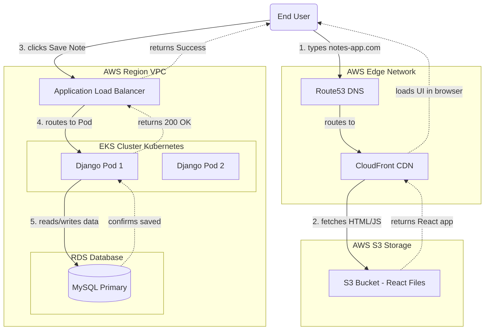

# The "Bestest" Cloud-Native Traffic Flow

When we shift to the modern Cloud-Native architecture, the flow of traffic is incredibly efficient. Here is exactly what happens from the moment a user types your website address into their browser, to the moment they get their data.

### Architecture Diagram

---

## Step-by-Step Workflow

### Phase 1: Loading the Website UI
1. **The Request:** The user types `notes-app.com` in their browser. The DNS (Route53) directs them to **AWS CloudFront**.
2. **The Cache:** CloudFront is a global CDN. If the user is in London, CloudFront checks its London data center. If it has your React files cached, it sends them to the user instantly!
3. **The Source:** If the files aren't cached, CloudFront grabs the raw HTML/JS/CSS files from your **S3 Bucket**.
4. **The Result:** The React application loads instantly in the user's browser. **Notice:** No Kubernetes pods or servers were used to do this!

### Phase 2: Interacting with Data (The API)
Now the user's browser has loaded the UI, and they want to actually use the app.

1. **The API Call:** The user types a note and clicks "Save". The React app running in their browser makes an HTTP request to `notes-app.com/api/notes/`.
2. **The Load Balancer:** This `/api` request hits your **AWS Application Load Balancer (ALB)**. The ALB acts as your reverse proxy. It sees the `/api` path and knows this must go to the backend.
3. **The Kubernetes Cluster:** The ALB forwards the request into your **EKS Cluster**, distributing it to one of your healthy **Django Pods**.
4. **The Database:** The Django pod processes the Python logic and writes the new note into your **AWS RDS (MySQL)** database.
5. **The Response:** RDS confirms the save, Django generates a "Success" response, the ALB passes it back, and the React UI shows a green checkmark!

### Why this is the "Bestest" Approach:
* **Cost:** Serving files from S3/CloudFront costs almost nothing. You aren't paying for Nginx servers running 24/7.
* **Speed:** CloudFront puts your React app physically closer to users around the globe.
* **Security & Focus:** Your Kubernetes cluster is now completely locked down. It is entirely focused on executing heavy Python backend logic and interacting with the secure RDS database, rather than wasting compute power handing out static images or HTML files.
